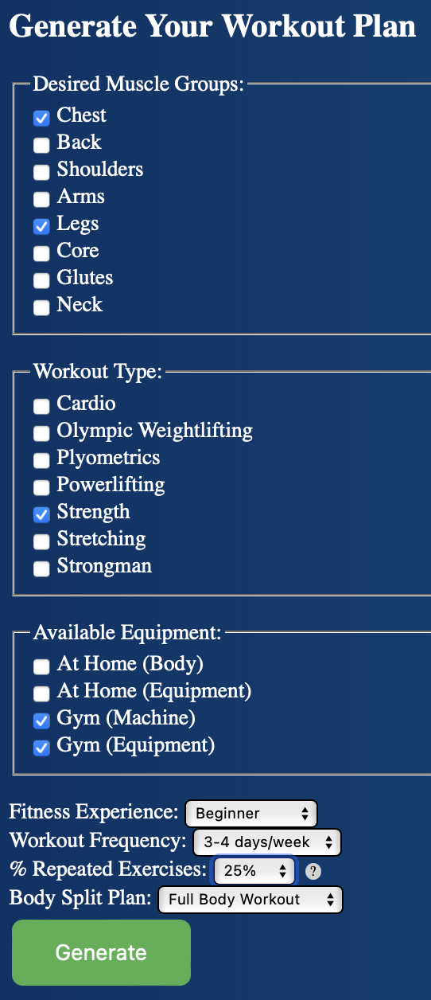

# Workout Recommender

This repository contains a web application designed to recommend personalized workout plans based on user inputs like fitness level, desired muscle groups, available equipment, and workout frequency.

## Repository Structure

### app

- **app.py**: The main Flask application script. It handles user inputs, processes requests, and generates workout plans using pre-trained models and OpenAI API.

### data

- Contains CSV files and other data necessary for the application, including exercise data and user inputs.

### ipynb

- **clean_and_process_data.ipynb**: This notebook is responsible for loading, cleaning, and processing exercise data. It involves data transformation, feature engineering, and merging with user inputs to prepare the data for the recommendation system.

- **develop_and_validate_model.ipynb**: This notebook covers feature selection, processing, and the development of a preprocessing pipeline. It builds and tests a content-based filtering model using cosine similarity for exercise recommendations.

- **generate_mock_user_inputs.ipynb**: Generates a mock dataset simulating user inputs for testing the system. It defines parameters like fitness experience, muscle groups, and workout types, and synthesizes data accordingly.

- **generate_workout_plan.ipynb**: Utilizes the OpenAI API to generate comprehensive workout schedules based on user preferences. It includes functions for recommending similar exercises and creating detailed workout plans.

### model

- **full_feature_pipeline.pkl**: A pre-trained content-based filtering model. It enables the application to recommend exercises without needing additional training data.

## Requirements

Below are the Python libraries required to run the scripts in this repository:

```plaintext
numpy==1.24.0
matplotlib==3.6.3
seaborn==0.11.2
nltk==3.6.3
openai==0.27.2
Flask==2.3.2
scikit-learn==1.1.3
python-dotenv==1.0.1
scipy==1.9.3
kneed==0.7.0
```

To install the dependencies, use:

```bash
pip install -r requirements.txt
```

## Usage

1. Clone the repository.
2. Set up a virtual environment and install dependencies.
3. Obtain an OpenAI API key and set it in your environment variables.
4. Run the Flask app using `python app.py`.
5. Access the web app through the local server and input your fitness preferences to get a personalized workout plan.



---

This README file provides an overview of the project structure, descriptions of key files, and instructions for setting up and using the application.
